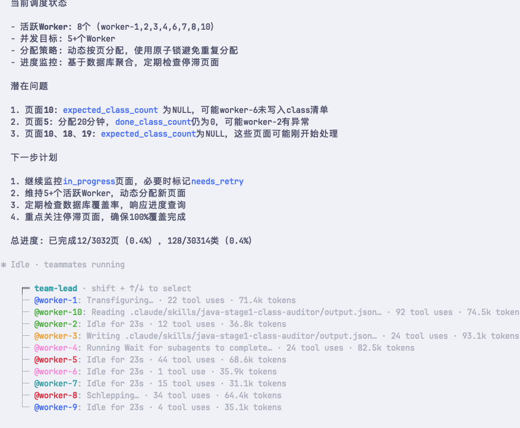
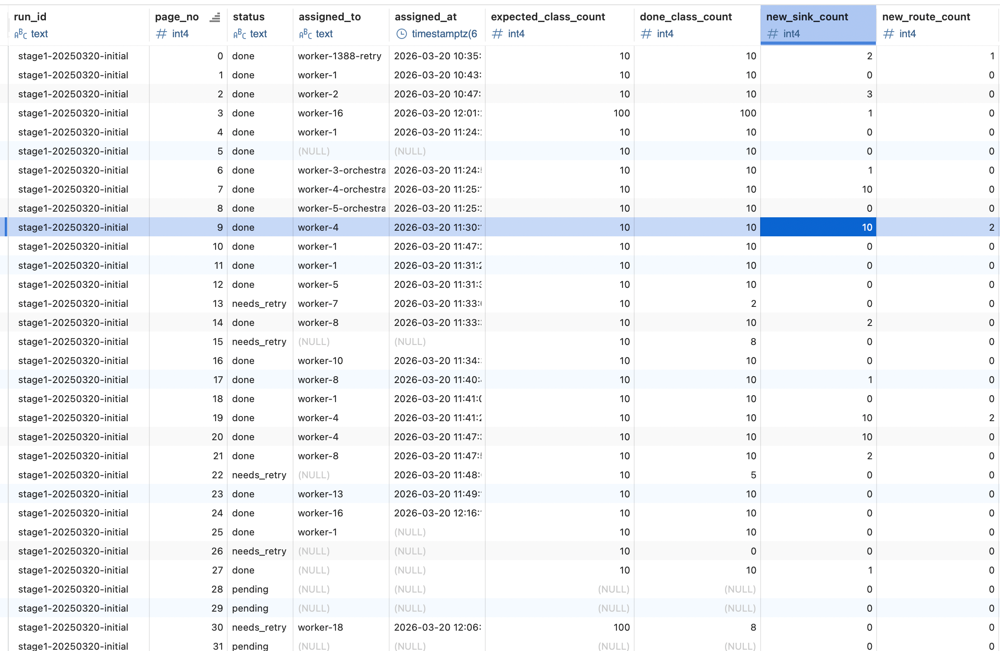

# AuditSkillOrchestrator

Java 自动化漏洞挖掘编排器（Claude Code Skills + MCP + Postgres 状态后端）。当前发布 **Stage1：实现对项目全量覆盖的审计**。

- Stage1 技能集入口：[java-stage1-audit-skill-cluster/skills/README.md](./java-stage1-audit-skill-cluster/skills/README.md)

## 目标

- 对目标 Java 项目做“可验证”的 100% 类覆盖扫描（以 DB 计数为准）
- 提取并结构化存储挖洞关键信号：入口/路由、敏感 sink、鉴权相关线索
- 用编排器把“长任务 + 多 worker + 可恢复进度 + 可审计输出”做成流水线

## 工作方式（Stage1）

大规模 Java 项目审计，如果一开始就做调用链分析、污点传播、PoC 验证，成本和不确定性都很高。更可靠的路径是：

- **Stage1：全覆盖枚举与标记**（先把“sink、路由、鉴权相关线索”找出来并结构化存储）
- Stage2+：在 Stage1 线索之上逐步做更重、更准确的分析（调用链、可控性、利用、验证等）

### 依赖组件

- `jadx-ai-mcp`：提供“按类/按方法”读取反编译源码与结构信息的 MCP 工具（如 `get_all_classes/get_methods_of_class/get_fields_of_class/get_method_by_name`）
- `postgres-mcp`：提供对 Postgres 的 MCP 操作能力，让所有状态/记录统一写入数据库，形成覆盖率闭环与可恢复进度

### 覆盖率如何判定

Stage1 的“覆盖”以 **数据库计数**为准：

- 每个 page 会写入 `expected_class_count`
- 每个 class 最终必须写入 `stage1_classes.status=done`
- page 满足 `done_class_count == expected_class_count` 才算完成

### 流程概览

Stage1 由“主编排器 + 多 worker + 单类 subagent”组成：

- 主编排器按页动态调度 worker（Team/Teammate 模式，避免阻塞主会话）
- worker 负责本页 class 清单入库、并逐类创建 subagent 做三维审计，然后把结果写入 Postgres
- subagent（class-auditor）对单个 class 做三维审计输出：
  - sinks（敏感 API / sink 点）
  - routes（路由/入口映射）
  - auth\_markers（鉴权相关线索标记）

为了降低成本，Stage1 默认采用“先粗筛、再按需拉源码”的方式：

- 先用 `get_methods_of_class()` + `get_fields_of_class()` 获取方法签名与字段列表，粗判是否可能与 sink/route/auth 相关
- 若不相关：直接结束并标记该类 `code_context_level=members_only`
- 若相关：仅对少量可疑方法用 `get_method_by_name()` 拉取方法源码，再做识别与提取，并标记 `code_context_level=method_source`

## 快速开始（Claude Code）

### 1) 前置条件

1. 安装并配置 MCP：
   - `jadx-ai-mcp`（用于读取类/方法/字段/方法源码）
   - `postgres-mcp`（用于对 Postgres 执行 SQL）
2. 开启 Claude Code Agent Teams：
   - 环境变量：`CLAUDE_CODE_EXPERIMENTAL_AGENT_TEAMS=1`
3. 启动 Postgres 数据库，并确保创建/可连接到数据库

### 2) 放置技能集到目标项目

将本仓库的 `java-stage1-audit-skill-cluster/` 下的内容整体复制到你要审计的目标项目的 `.claude/` 目录中，复制后的目录结构如下：

```
<target-project>/.claude/skills
<target-project>/.claude/db
```

### 3) 启动审计

在 Claude Code 中调用：

- `/java-stage1-coverage-orchestrator`

它会完成：

- 初始化数据库（必要时建表/安装函数/安装约束迁移）
- 计算总类数与分页
- 创建 Team/Teammate 并动态调度 `/java-stage1-coverage-worker`
- 通过数据库统计闭环校验覆盖率

常用辅助：

- 进度查询：`/java-stage1-status-checker`（只读 DB）
- DB 初始化/迁移/函数安装：参考 [POSTGRES\_MCP\_PLAYBOOK.md](./java-stage1-audit-skill-cluster/skills/java-stage1-coverage-orchestrator/references/POSTGRES_MCP_PLAYBOOK.md)


**效果演示**





## 最佳实践
- 可以先剔除第三方组件的jar，只对项目代码做审计。

## 贡献

欢迎提交 Issue 和 Pull Request 来完善项目功能。

## Roadmap

- [] 优化 sink/route/auth 规则
- [] 优化 skill 大小
- [] skill英文化
- [] 优化 worker 调度 subagent 逻辑
- [] 缓解主 agent 上下文容易爆炸
- [] Stage2/3/4/5（规划）：调用链分析、跨类关联、PoC 编写、验证与报告生成

## Acknowledgements / References

- <https://github.com/zinja-coder/jadx-ai-mcp>
- <https://github.com/crystaldba/postgres-mcp>
- <https://github.com/RuoJi6/java-audit-skills>
- <https://github.com/H4cking2theGate/AuditSkills>

